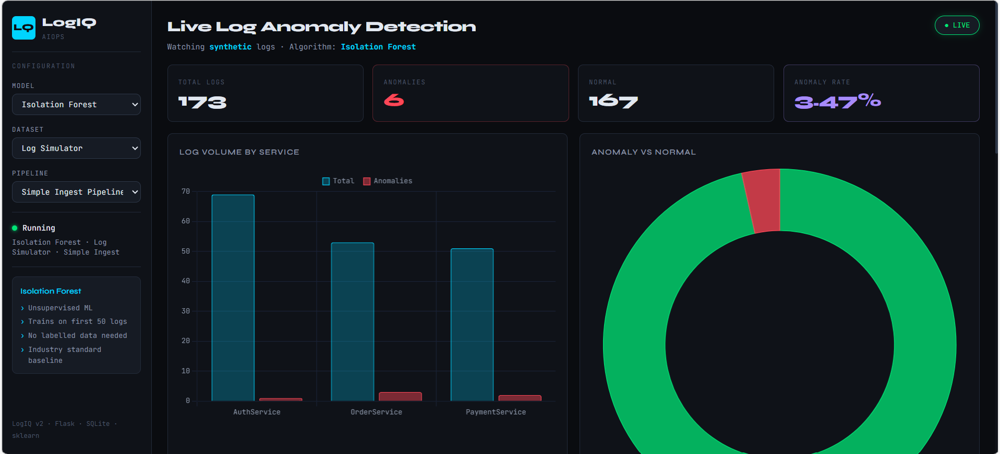
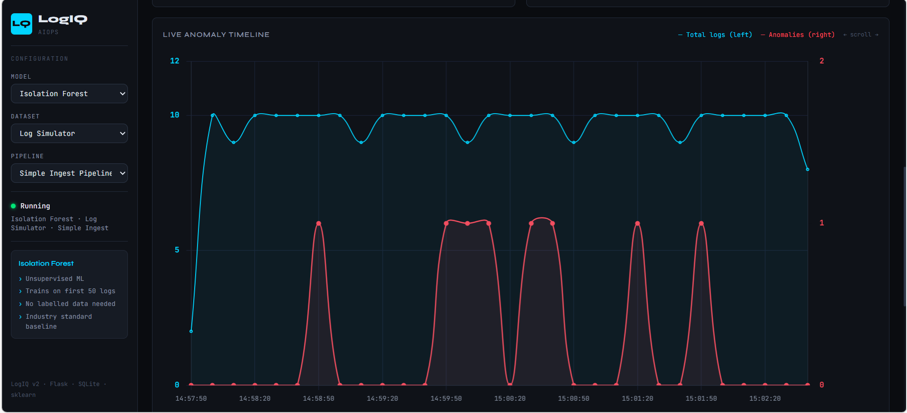
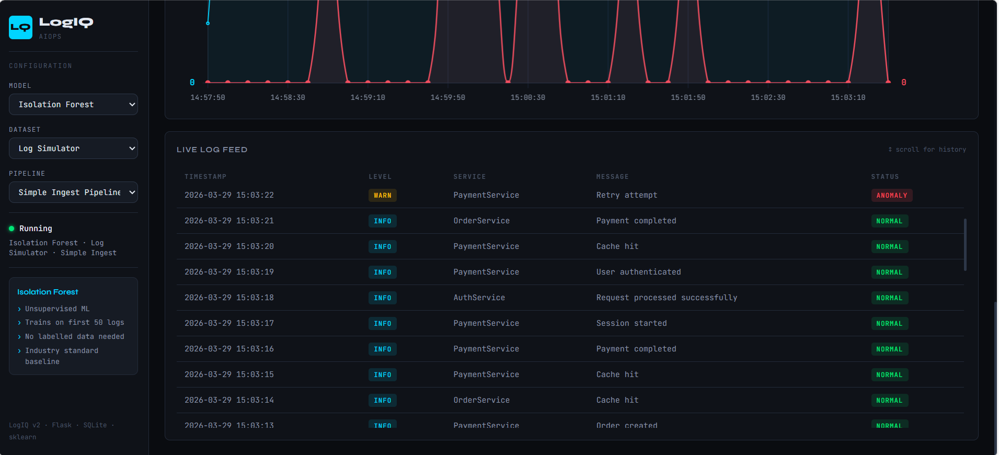

# 🚀 LogIQ — AI-Powered Log Anomaly Detection Dashboard

LogIQ is a real-time log monitoring and anomaly detection system built using machine learning.
It ingests logs, detects anomalies, and visualizes insights through an interactive dashboard.

---

## 🌐 Live Demo

> 🔗 Live Dashboard: ***Coming Soon***
> (Will be deployed on Vercel + Render)

---

## 📌 Features

* 🔍 Real-time log ingestion and processing
* 🤖 ML-based anomaly detection (Isolation Forest, LSTM)
* 📊 Interactive dashboard with charts and live metrics
* 🔄 Dynamic dataset, model, and pipeline switching
* ⚡ Auto-refresh with near real-time updates
* 🧩 Modular architecture for easy extensibility
* 📂 Supports both synthetic and real-world datasets

---

## 🏗️ Architecture

```
User (Browser)
      │
      ▼
Frontend (HTML/CSS/JS)
      │
      ▼
Flask Backend (REST API)
      │
      ▼
Pipeline (File / Kafka)
      │
      ▼
Preprocessing → Feature Extraction
      │
      ▼
ML Model (Isolation Forest / LSTM)
      │
      ▼
Storage (SQLite)
      │
      ▼
Dashboard APIs → Frontend Updates
```

---

## 📸 Dashboard Preview

### 🔹 Overview Dashboard


### 🔹 Timeline Visualization


### 🔹 Live Logs Feed


---


## 🏗️ Project Structure

```
Anomaly_detection/
│
├── config/              # Configuration settings
│   └── settings.py
│
├── datasets/            # Data sources
│   ├── base.py
│   ├── synthetic.py
│   └── nasa.py
│
├── preprocessing/       # Parsing + feature extraction
│   ├── base.py
│   ├── synthetic.py
│   ├── nasa.py
│   └── utils.py
│
├── models/              # ML models
│   ├── base.py
│   ├── isolation_forest.py
│   └── lstm.py
│
├── pipeline/            # Data pipelines
│   ├── base.py
│   ├── file.py
│   └── kafka.py
│
├── storage/             # Storage layer
│   ├── base.py
│   ├── sqlite.py
│   └── elasticsearch.py # Future scope
│
├── backend/             # Flask REST API
│   └── app.py
│
├── frontend/            # Dashboard UI
│   ├── index.html
│   ├── style.css
│   └── script.js
│
├── streamlit_app/       # Optional UI
│   └── app.py
│
├── docker-compose.yml
├── requirements.txt
└── run.py
```     

---

## ⚙️ How It Works

```
Logs → Preprocessing → Feature Extraction → Model Prediction → Storage → Dashboard
```

1. Logs are generated or ingested
2. Preprocessor extracts meaningful features
3. ML model predicts anomaly
4. Results stored in database
5. Dashboard visualizes data in real-time

---

## 🧠 Models Used

### 🔹 Isolation Forest

* Unsupervised anomaly detection
* Efficient for structured data
* Fast and lightweight

### 🔹 LSTM

* Sequence-based anomaly detection
* Learns temporal patterns
* Suitable for time-series logs

---

## 📂 Datasets

### 🔹 Synthetic Logs

* Generated logs for testing and development

### 🔹 NASA Logs

* Real HTTP access logs (July 1995)
* High-volume real-world dataset

---

## 🚀 Getting Started

### 1. Clone the repository

```bash
git clone https://github.com/Manupoojary/LogIQ-Anomaly-Detection
cd logiq
```

---

### 2. Create virtual environment

```bash
python -m venv .venv
```

Activate:

* Windows:

```bash
.venv\Scripts\activate
```

* Linux/Mac:

```bash
source .venv/bin/activate
```

---

### 3. Install dependencies

```bash
pip install -r requirements.txt
```

---

### 4. Run the application

```bash
python run.py --backend --storage sqlite
```

---

### 5. Open dashboard

```
http://localhost:5000
```

---

## 🔄 Pipelines

### 🔹 File Pipeline

* Lightweight
* Runs locally
* Recommended for development

### 🔹 Kafka Pipeline

* Streaming-based
* Requires Docker setup
* Suitable for production-scale systems

---

## 📊 Dashboard Capabilities

* Total logs processed
* Anomaly detection count
* Anomaly rate (%)
* Service-wise distribution
* Timeline visualization
* Live log streaming

---

## 📈 Performance Metrics

Displayed in console:

* Total logs processed
* Anomalies detected
* Anomaly rate (%)
* Throughput (logs/sec)

---

<!-- ## 🌐 Deployment (Free)

| Component | Platform |
| --------- | -------- |
| Frontend  | Vercel   |
| Backend   | Render   |
| Storage   | SQLite   |

> ⚠️ Use File Pipeline for deployment (Kafka not supported on free tier)

--- -->

## 🧩 Extending the Project

### ➕ Add Dataset

* Create in `datasets/`
* Register in `datasets/utils.py`
* Add corresponding preprocessor

### ➕ Add Model

* Create in `models/`
* Register in `models/utils.py`

### ➕ Add Pipeline

* Create in `pipeline/`
* Register in `pipeline/utils.py`

---

## 🛠️ Tech Stack

* **Backend:** Flask (Python)
* **Frontend:** HTML, CSS, JavaScript
* **Machine Learning:** Scikit-learn, NumPy
* **Storage:** SQLite
* **Streaming:** Kafka (optional)

---

## 🚧 Future Scope

* Elasticsearch integration for scalable storage
* Model comparison dashboard
* Alerting system (Email / Slack)
* Distributed pipelines
* Real-time model retraining

---

## 📄 License

MIT License

---

## 👨‍💻 Author

**Manohara Poojary**
